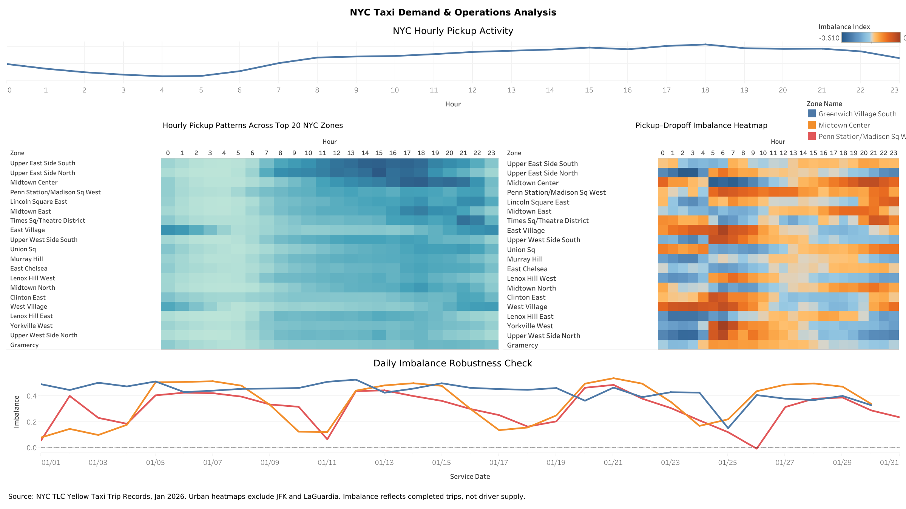

# NYC Taxi Demand & Operations Analysis

Analyzed **3.5M+ NYC Yellow Taxi trips** using SQL, Python, and Tableau to identify temporal demand patterns, zone-level pickup–dropoff asymmetry, and recurring operational signals across New York City taxi zones.

🔗 **[View Interactive Tableau Dashboard](https://public.tableau.com/views/NYCTaxiDemandOperationsAnalysis/NYCTaxiDemandOperationsAnalysis)**

## Business Question

**How do spatial and temporal trip patterns reveal potential operational pressure points for urban mobility platforms?**

Rather than only asking when taxis are busiest, this project examines how demand concentration and pickup–dropoff patterns vary by **zone, hour, and day type**.

## Dataset

**NYC Taxi & Limousine Commission (TLC) Yellow Taxi Trip Records — January 2026**

The raw dataset contained approximately **3.72 million trip records**.

Key fields used include:

- Pickup and dropoff timestamps
- Pickup and dropoff zone IDs
- Trip distance
- Fare and total amount
- Taxi zone and borough information

Data source: [NYC TLC Trip Record Data](https://www.nyc.gov/site/tlc/about/tlc-trip-record-data.page)

## Data Cleaning

Used SQL and Python to validate trip records and remove observations with:

- Non-positive trip distance
- Negative fares
- Invalid pickup/dropoff time order
- Implausible average speeds above 80 mph
- Trip durations above 4 hours
- Negative total amounts

The final analytical dataset contained **3,515,940 trips**.

## Analysis

The project used SQL techniques including:

- CTEs
- JOINs
- Window functions
- Percentiles
- Conditional aggregation
- Zone × hour analysis

Custom metrics included:

### Demand Over-Index

Measures whether a zone is disproportionately active during a particular hour relative to the citywide hourly baseline.

### Pickup–Dropoff Imbalance

Measures directional trip-flow asymmetry:

- Positive values → pickup-heavy
- Near zero → relatively balanced
- Negative values → dropoff-heavy

This metric identifies **operational signals**, not confirmed driver shortages.

## Key Findings

### 1. Distinct temporal demand patterns

High-volume NYC taxi zones exhibit different peak operating windows rather than following one citywide demand profile.

### 2. Strong relative demand concentration in late-night downtown zones

Several downtown Manhattan zones showed approximately **3–6× hourly over-index** relative to the citywide baseline during selected late-night periods.

### 3. Recurring pickup-heavy operating windows

Day-level robustness checks showed persistent pickup-heavy patterns:

- **Greenwich Village South:** pickup-heavy on 30/30 observed days
- **Midtown Center:** pickup-heavy on 30/30 observed days
- **Penn Station / Madison Sq West:** pickup-heavy on 30/31 observed days

Greenwich Village South maintained similar imbalance intensity across weekday and weekend nights, while weekend pickup volume was substantially higher.

Midtown Center showed a much stronger weekday evening imbalance than weekend imbalance.

## Tableau Dashboard

The interactive dashboard includes:

- NYC hourly pickup activity
- Top 20 zone × hour pickup heatmap
- Pickup–dropoff imbalance heatmap
- Daily robustness analysis

🔗 **[Open Tableau Dashboard](https://public.tableau.com/views/NYCTaxiDemandOperationsAnalysis/NYCTaxiDemandOperationsAnalysis)**

## Tools

- **SQL:** DuckDB
- **Python:** Pandas, Matplotlib
- **Visualization:** Tableau
- **Environment:** Google Colab

## Repository Files

- [`NYC_Mobility_Demand_Analysis.ipynb`](NYC_Mobility_Demand_Analysis.ipynb) — Full analysis notebook
- [`mobility_analysis.sql`](mobility_analysis.sql) — Standalone SQL queries
- [`dashboard.png`](dashboard.png) — Tableau dashboard preview

## Limitations

NYC TLC data contains completed taxi trips but does not include:

- Driver availability
- Empty vehicle repositioning
- Passenger wait times
- Cancellations
- Unmet demand

Therefore, pickup–dropoff imbalance should be interpreted as an **operational signal for further investigation**, not direct evidence of a supply shortage.

## Author

**Junzhi Zhang**  
M.S. Business Analytics, University of Rochester — Simon Business School

[LinkedIn](https://www.linkedin.com/in/serena-zhang-5b3546416/) · [Tableau Public](https://public.tableau.com/app/profile/serena.zhang6618/vizzes)
